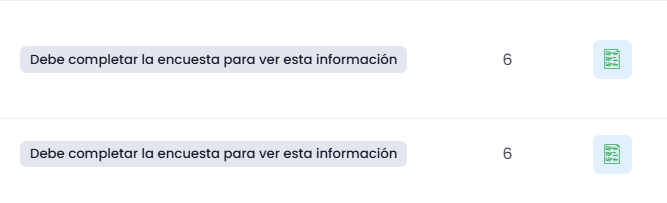
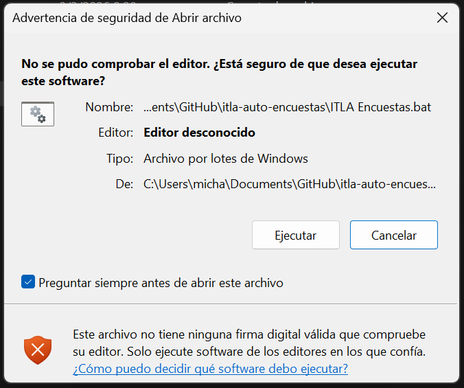
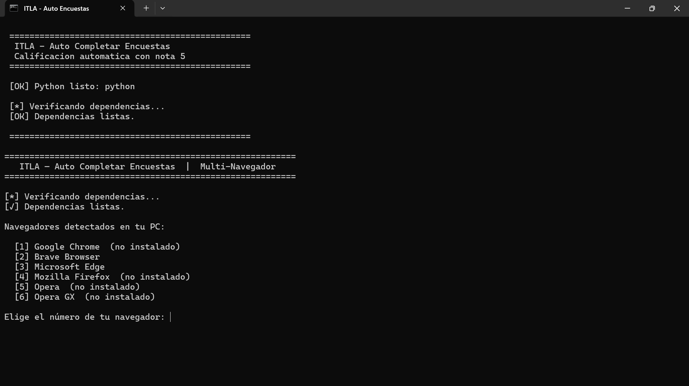

# ITLA — Auto Completar Encuestas

Script que completa automaticamente las encuestas de calificacion de maestros
en la plataforma del ITLA, seleccionando nota 5 en todas las preguntas.

---

## Lo unico que necesitas

- Conexion a internet (solo la primera vez)
- Tener instalado al menos uno de estos navegadores:
  Google Chrome, Brave, Microsoft Edge, Firefox, Opera o Opera GX

Nada mas. Python y todo lo demas se instala automaticamente.

---

## Recomendacion importante antes de ejecutar

Este script califica a TODOS los maestros pendientes con nota 5
de forma automatica y en orden.

**Si hay algun maestro al que quieras darle una nota diferente
(ya sea mas baja o personalizada), hazlo MANUALMENTE antes de
ejecutar el script.**

Una vez que lo ejecutes, completara todas las encuestas que
encuentre sin distincion. Las encuestas ya completadas no
se pueden modificar desde la plataforma.

En resumen:
- Evalua primero a mano los maestros que quieras calificar diferente
- Luego ejecuta el script y el hara el resto automaticamente

Asi se ve tu plataforma y eso es lo que eliminará:


Si ves esto no te alarmes lo puedes ejecutar con seguridad de que no pasará nada:


Y asi se ve la interfaz en el CMD:


---

## Instalacion

No hay instalacion. Solo pon estos dos archivos en la misma carpeta:

```
📁 Cualquier carpeta (ej: Escritorio)
   ├── itla_encuestas.py
   └── ITLA_Encuestas.bat
```

---

## Como usarlo

**1.** Haz doble clic en `ITLA_Encuestas.bat`

**2.** La primera vez descarga e instala Python automaticamente
   (tarda 1-2 minutos, solo ocurre una vez).

**3.** Elige tu navegador escribiendo su numero:

```
  [1] Google Chrome
  [2] Brave Browser
  [3] Microsoft Edge
  ...

Elige el número de tu navegador: 2
```

**4.** Se abre el navegador en la pagina del ITLA.
   Inicia sesion con tu usuario y contraseña.

**5.** Ya dentro, regresa al CMD y presiona ENTER.

**6.** El script hace todo solo hasta terminar todas las encuestas.

---

## Nota sobre la ventana extra del navegador

Es posible que al ejecutarse aparezca una ventana extra del navegador.
Es la que usa el script para trabajar. Simplemente cierrala al terminar
o ignorala, no afecta nada.

---

## Como detener el script

Si quieres parar antes de que termine, haz clic en la ventana del CMD
y presiona:

```
Ctrl + C
```

---

## Este programa es seguro — verificalo tu mismo

Es completamente normal desconfiar de un programa que descargaste
de internet, especialmente uno que abre tu navegador.

Por eso el codigo es 100% abierto y puedes verificarlo tu mismo
en menos de 5 minutos:

**Paso 1:** Abre el archivo `itla_encuestas.py` con el Bloc de notas
(clic derecho → Abrir con → Bloc de notas)

**Paso 2:** Selecciona todo el texto (Ctrl + A), copialo (Ctrl + C)

**Paso 3:** Ve a https://chatgpt.com y pega el codigo con este mensaje:

---

> Analiza este codigo de Python y dime de forma clara:
> 1. ¿Hace algo malicioso como robar contraseñas, datos personales
>    o archivos?
> 2. ¿Se conecta a algun servidor externo sospechoso?
> 3. ¿Instala algo sin permiso del usuario?
> 4. ¿Que hace exactamente paso a paso?
> Responde de forma sencilla y directa.
>
> [pega aqui el codigo]

---

ChatGPT o cualquier IA podra confirmarte que el script unicamente:
- Abre tu navegador
- Navega a la pagina del ITLA
- Hace clic en los botones de las encuestas
- No toca ningun archivo personal ni guarda ninguna contraseña

Si tienes alguna duda adicional, puedes compartir el codigo con
cualquier persona que sepa programar y pedirle que lo revise.

---

## Errores comunes

**"No se encontro itla_encuestas.py"**
El .bat y el .py deben estar en la misma carpeta.

**"Sin conexion a internet"**
Conectate a internet y vuelve a ejecutar, se necesita solo la primera vez.

**"No se encontraron encuestas pendientes"**
Asegurate de iniciar sesion y estar en la seccion correcta antes de
presionar ENTER: https://perfil.itla.edu.do/#/qualification-student

---

## Navegadores soportados

| Navegador      | Soportado |
|----------------|-----------|
| Google Chrome  | Si        |
| Brave          | Si        |
| Microsoft Edge | Si        |
| Firefox        | Si        |
| Opera          | Si        |
| Opera GX       | Si        |
| DuckDuckGo     | No        |
